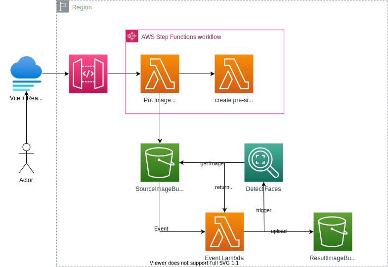

# Show Solidarity

[](https://github.com/tterb/atomic-design-ui/blob/master/LICENSEs)

Due to the current situation, we all need to show Solidarity.
Show flag 🇺🇦


## Pre-Requisite

- **Python:** 3.8.x ‼️‼️ (Recommendation: [pyenv](https://github.com/pyenv/pyenv))
- **NodeJS** >= 16.x
- **[`aws configure`](https://docs.aws.amazon.com/cli/latest/userguide/cli-configure-quickstart.html)**

### Tech Stack

- AWS Step Function
- AWS S3
- AWS Lambda
- Amazon Rekognition
- AWS CDK with Python
- Vite + Preact

## Install

```bash
make install
```

If for some reason it does not work,
here are the manual steps to install

```bash
python3 -m venv .venv
source .venv/bin/activate
pip install requirements.txt
```

## Deploy Infrastructure

This is what your infrastructure will look like



---
> **NOTE**
>
> Since CDK is not able to execute [AWS SSO named profiles](https://github.com/aws/aws-cdk/issues/5455), make sure you have exported the variables
>
> ```bash
> export AWS_ACCESS_KEY_ID="foo"
> export AWS_SECRET_ACCESS_KEY="bar"
> export AWS_SESSION_TOKEN="baz"
> ```
>
---


```bash
# Replace the variables with your account
make infra CDK_DEFAULT_ACCOUNT=123456789012 CDK_DEFAULT_PROFILE=default
```

### Lambda Layer

There is a weird issue with Lambda Function and using Pillow library.
Due to that, the function uses an open layer from [Klayers](https://api.klayers.cloud//api/v2/p3.8/layers/latest/eu-central-1/html).
Please, consider that the lambda is currently only working with Python 3.8 Runtime.
Make sure you install that also on your machine.
As a recommendation, you could use [pyenv](https://github.com/pyenv/pyenv).

```bash
pyenv install 3.8.12 # or any 3.8.x version
pyenv local 3.8.12
```

## Running Tests

To run tests, run the following command

```bash
make test
```

## Cleaning

### Destroy Infrastructure

```bash
make destroy_infra
```

### Delete Caches and Packages of Lambda

```bash
make clean
```

## License

[MIT](https://choosealicense.com/licenses/mit/)

### Images

[Ukraine Flag Vectors by Vecteezy]("https://www.vecteezy.com/free-vector/ukraine-flag")

Photo by [Omid Armin](https://unsplash.com/@omidarmin?utm_source=unsplash&utm_medium=referral&utm_content=creditCopyText") on [Unsplash]("https://unsplash.com/s/photos/portraits?utm_source=unsplash&utm_medium=referral&utm_content=creditCopyText").